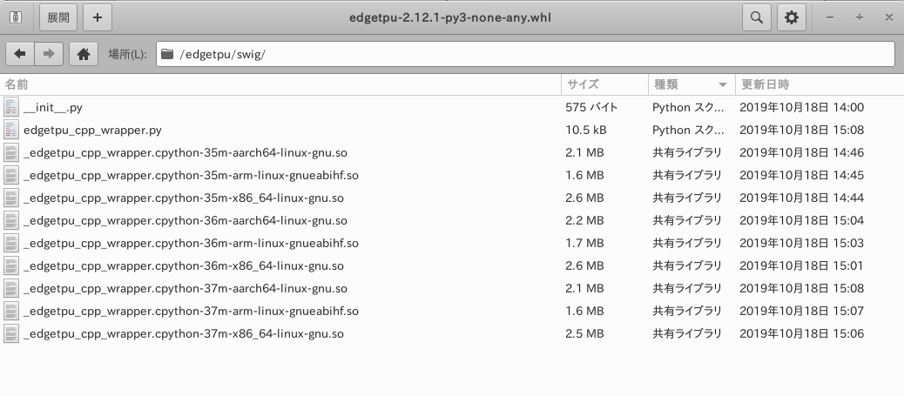

# edgetpu-bin

**[Warning] As of October 19, 2019, the operation is unstable.**  
  
  
  
## 1. Reference articles
**https://github.com/google-coral/edgetpu#build-and-install-from-source**

## 2. Environment

- Ubuntu 18.04 x86_64

## 3. Procedure

```bash
$ cd ~
$ git clone https://github.com/google-coral/edgetpu.git
$ cd edgetpu

$ mkdir -p bin
$ export PATH=$PATH:$HOME/bin
$ curl https://storage.googleapis.com/git-repo-downloads/repo > ~/bin/repo
$ chmod a+x ~/bin/repo

$ git config --global user.name "Your Name"
$ git config --global user.email "you@example.com"

$ repo init -u https://coral.googlesource.com/manifest -b release-day
$ repo sync -j$(nproc)

$ scripts/runtime/install.sh
$ scripts/build_swig.sh
$ make wheel
```

The wheel file is generated in the following path.  
**`~/edgetpu/dist/edgetpu-2.12.1-py3-none-any.whl`**  
  
  
  

## 4. Usage

```bash
$ sudo pip3 install edgetpu-2.12.1-py3-none-any.whl
$ sudo sh -c "echo 'SUBSYSTEM==\"usb\", ATTR{idVendor}==\"0525\", MODE=\"0664\", \
GROUP=\"plugdev\", TAG+=\"uaccess\"' >> /etc/udev/rules.d/65-android-local.rules"
$ sudo udevadm control --reload-rules && udevadm trigger
```

## 5. Operation check

```bash
$ git clone https://github.com/google-coral/tflite.git
$ cd tflite/python/examples/classification
$ bash install_requirements.sh

$ python3 classify_image.py \
--model models/mobilenet_v2_1.0_224_inat_bird_quant_edgetpu.tflite \
--labels models/inat_bird_labels.txt \
--input images/parrot.jpg
```
